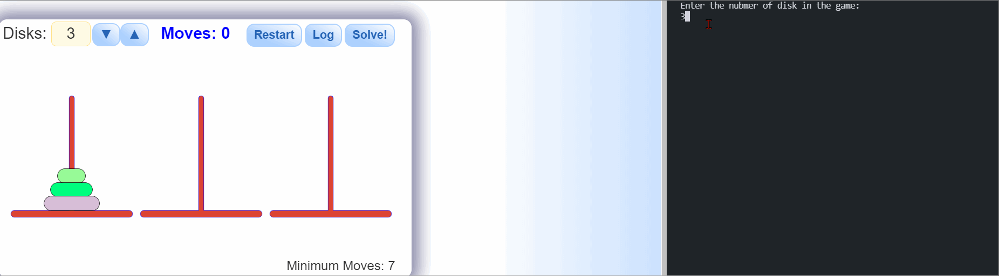

# Hanoi-Solver

Hanoi Slover 

# Project - *Hanoi Slover*

**Hanoi Slover** is use to get the solution for the Hanoi game.

Submitted by: **Zhuohao Tan**

Time spent: **2** hours spent in total

## Purpose
The purpose of this assignment is to learn about a new programming language that I am not familiar with. For this assignment, I chose Prolog, a language commonly used in puzzle-solving and AI, which I am interested in. The assignment also required building a project using the chosen language. Therefore, I planned to build a solver for "The Tower of Hanoi."
"The Tower of Hanoi" is one of the few projects I worked on when I started learning how to code. I previously used Python to build the project. It was very challenging and required a lot of time to understand the recursions used in the code. For this assignment, I want to use Prolog to build a solver for the Tower of Hanoi and see the differences between the two languages.

## Language Overview
	Prolog is a fifth-generation high-level programming language. Prolog is a distinctive language based on the logic programming paradigm. Prolog can be implemented as both compiled or interpreted, however, most of the common Prolog system usually offers an interpreted environment. Prolog is a declarative language, which I think is what makes it an even higher level of language compared to Python, where you have to tell them what to do step by step. However, in Prolog, you can pretty much just tell the program what are the end goals and some rules. It is able to solve the problem. 

## Program Description 
The goal of this project is to solve the well-known puzzle "The Towers of Hanoi." The Tower of Hanoi is a mathematical puzzle that involves moving a set of disks from one rod to another while following specific rules: a larger disk cannot be placed on top of a smaller disk, and only one disk can be moved at a time. The program uses Prolog and implements two functions to solve the problem: hanoi(DiskNum) and move(DiskNum, Beginning, Destination, Temporary).
The hanoi function asks the user how many disks they want to solve for and then calls the move function. The move function uses recursion, with a base case where no action is taken if the number of disks is 0. The function also ensures the number of disks is valid, meaning the puzzle cannot be solved with less than or equal to 0 disks. The move function consists of two recursive calls and print statements but can be broken down into three steps:
The first recursive call, move(NewDiskNum, Beginning, Temporary, Destination), moves all the disks except the largest one from the beginning rod to the temporary (middle) rod.
The print statement moves the largest disk from the beginning rod to the destination rod.
The second recursive call, move(NewDiskNum, Temporary, Destination, Beginning), moves the disks from the temporary (middle) rod to the destination rod.
Overall, the program doesn’t fully leverage the advantages of a declarative language due to the necessity of establishing many rules, the challenges of printing steps for the user to follow declaratively, and whether the solution is optimal. The solution is implemented using recursion, which is easier and optimal in this case. The declarative advantage doesn't stand out due to the program's use of recursion. Therefore, there is not a significant difference between Python and Prolog when implementing a solution for the Tower of Hanoi puzzle. This assignment demonstrates that not all puzzles are suitable for a purely declarative approach. In this case, the Tower of Hanoi is a classic problem that is traditionally solved using recursion.

## Video Walkthrough

Here's a walkthrough of implemented user stories:

GIF created with [LiceCap](http://www.cockos.com/licecap/).

